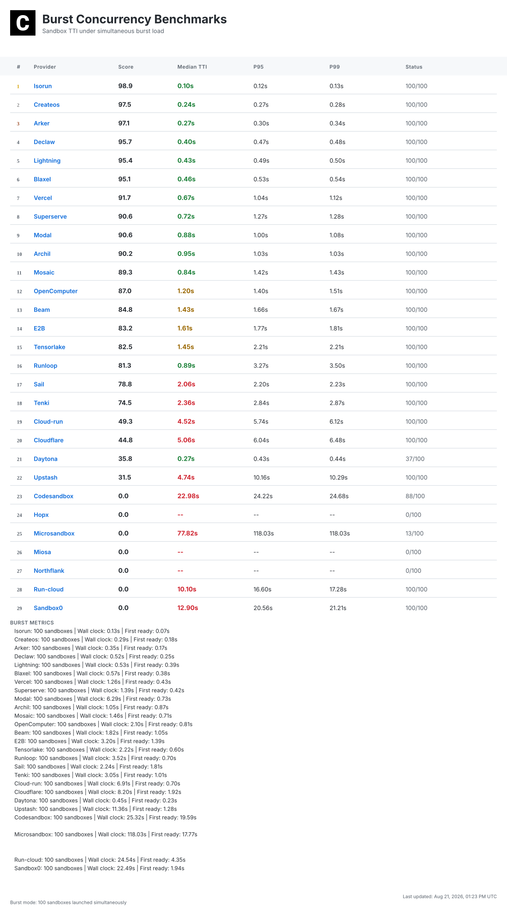
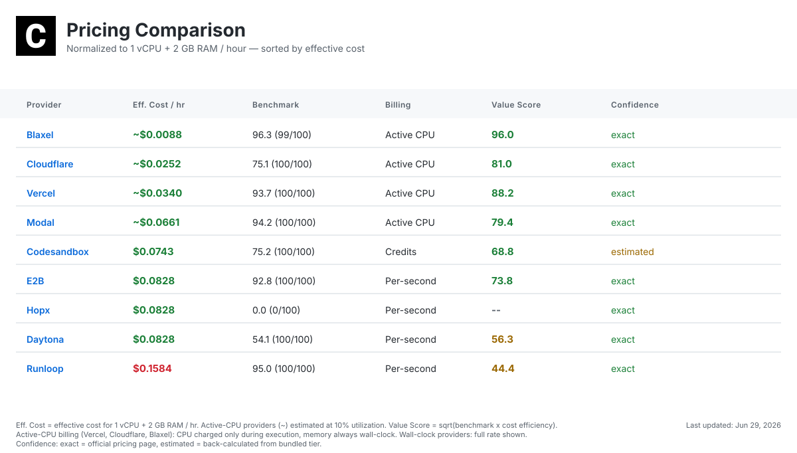
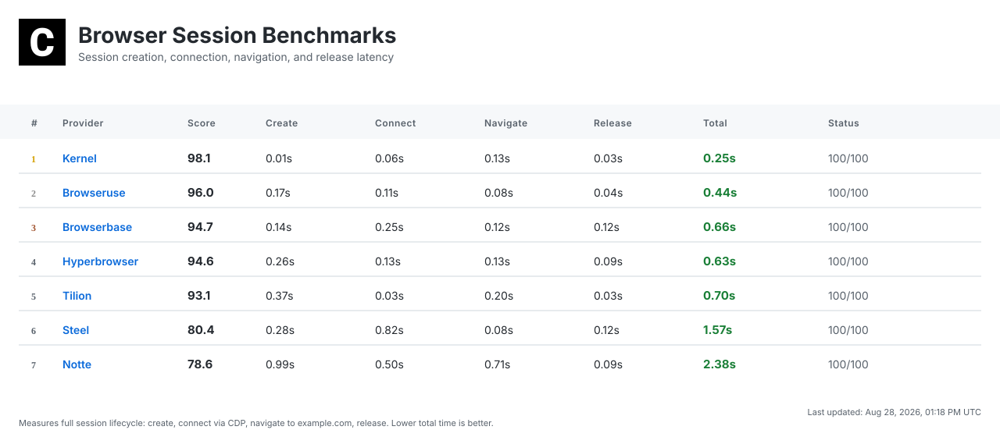
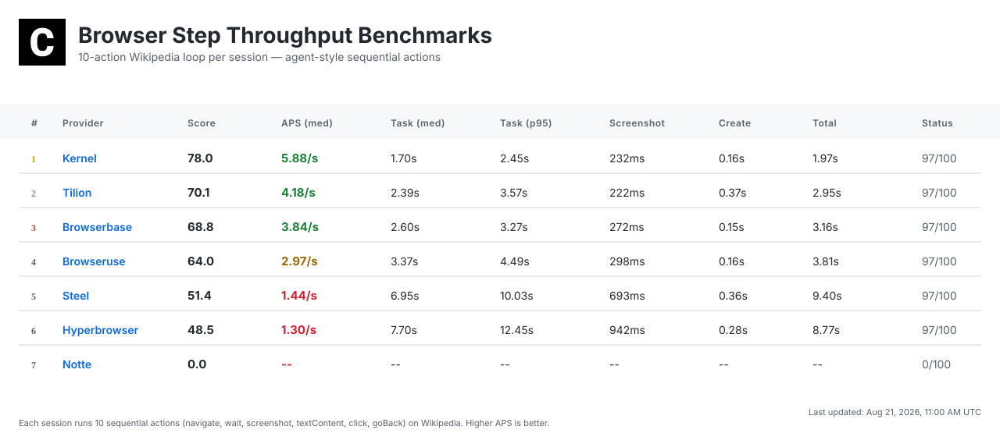
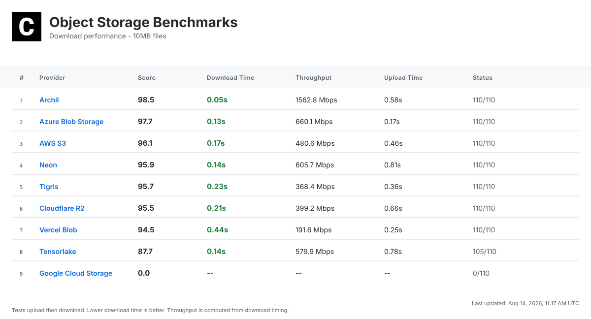
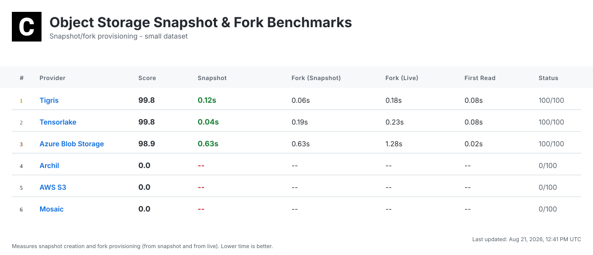
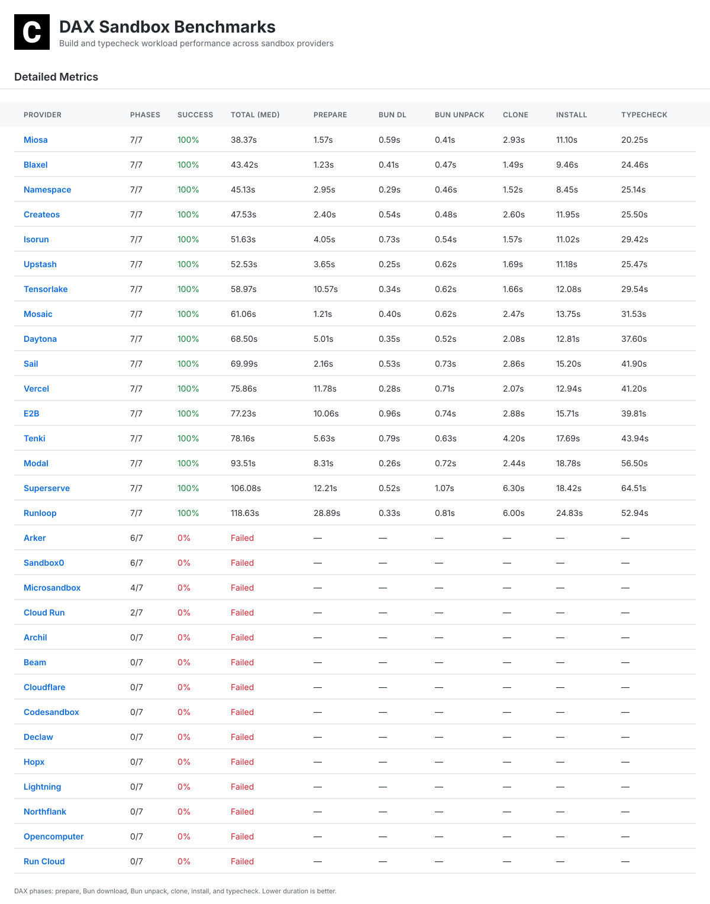

# ComputeSDK Benchmarks

**The default platform for cloud infrastructure benchmarks.**

ComputeSDK Benchmarks publishes reproducible, provider-neutral performance measurements for the infrastructure that AI agents and developer platforms run on: sandboxes, object storage, headless browsers, and AI gateways. Every test is automated, every result is committed as JSON, and the methodology is public.

Live leaderboards and full methodology: [https://www.computesdk.com/benchmarks](https://www.computesdk.com/benchmarks)

For LLMs and agents: see [`llms.txt`](./llms.txt) for a machine-readable index of this repo, and [`results/schema.json`](./results/schema.json) for the JSON Schema of every benchmark result file.

## Partners

Our partners support our independent benchmarks.

<strong>★ SILVER</strong>

  <a href="https://latitude.sh/?utm_source=github&utm_medium=readme&utm_campaign=benchmarks-sponsor">
    <picture>
      <source media="(prefers-color-scheme: dark)" srcset="https://logos.computesdk.com/api/svg/latitude/bounded/logo-dark">
      
    </picture>
  </a>
  &nbsp;&nbsp;&nbsp;
  <a href="https://cloud.google.com/run?utm_source=github&utm_medium=readme&utm_campaign=benchmarks-sponsor">
    <picture>
      <source media="(prefers-color-scheme: dark)" srcset="https://logos.computesdk.com/api/svg/google-cloud-run/bounded/logo-dark">
      
    </picture>
  </a>

<strong>+ BRONZE</strong>

  <a href="https://www.browserbase.com/?utm_source=github&utm_medium=readme&utm_campaign=benchmarks-sponsor">
    <picture>
      <source media="(prefers-color-scheme: dark)" srcset="https://logos.computesdk.com/api/svg/browserbase/bounded/logo-dark">
      
    </picture>
  </a>
  &nbsp;&nbsp;&nbsp;
  <a href="https://www.tigrisdata.com/?utm_source=github&utm_medium=readme&utm_campaign=benchmarks-sponsor">
    <picture>
      <source media="(prefers-color-scheme: dark)" srcset="https://logos.computesdk.com/api/svg/tigris/bounded/logo-dark">
      
    </picture>
  </a>
  &nbsp;&nbsp;&nbsp;
  <a href="https://neon.com/?utm_source=github&utm_medium=readme&utm_campaign=benchmarks-sponsor">
    <picture>
      <source media="(prefers-color-scheme: dark)" srcset="https://logos.computesdk.com/api/svg/neon/bounded/logo-dark">
      
    </picture>
  </a>
  &nbsp;&nbsp;&nbsp;
  <a href="https://www.gitbook.com/?utm_source=github&utm_medium=readme&utm_campaign=benchmarks-sponsor">
    <picture>
      <source media="(prefers-color-scheme: dark)" srcset="https://logos.computesdk.com/api/svg/gitbook/bounded/logo-dark">
      
    </picture>
  </a>

<strong>BENCHMARKS POWERED BY</strong>

  <a href="https://namespace.so/?utm_source=github&utm_medium=readme&utm_campaign=benchmarks-sponsor">
    <picture>
      <source media="(prefers-color-scheme: dark)" srcset="https://logos.computesdk.com/api/svg/namespace/bounded/logo-dark">
      
    </picture>
  </a>

<a href="./SPONSORSHIP.md">Become a sponsor →</a>

 

## What We Measure

We benchmark the infrastructure that AI agents and developer platforms rely on:

- **Sandboxes** — cold-start and concurrent **Time to Interactive (TTI)**: API request to first successful command inside a fresh sandbox.
- **Object storage** — upload/download latency and throughput across providers and file sizes.
- **Headless browsers** — session creation, navigation, and step throughput.
- **AI gateways** — cold/warm connection latency and time to first token.

## Methodology

Every benchmark uses the same open code against every provider, with fixed workloads and a fixed scoring ceiling. Tests run automatically on GitHub Actions, and every result is committed as JSON to this repo. Each metric includes min, max, median, P95, and P99; a composite score rewards both speed and reliability.

For full details on each suite, see:

- [Sandbox TTI methodology →](./METHODOLOGY.md)
- [Browser and throughput methodology →](./THROUGHPUT.md)
- [AI gateway methodology →](./AI_GATEWAYS.md)

## Transparency

- 📖 **Open source** — All benchmark code is public
- 📊 **Raw data** — Every result committed to repo as JSON
- 🔁 **Reproducible** — Anyone can run the same tests
- ⚙️ **Automated** — Daily at 5pm Pacific (00:00 UTC) via GitHub Actions on Namespace runners
- 🛡️ **Independent** — Sponsors cannot influence results

## Latest Benchmarks

> **Retired benchmarks:** The sequential and staggered sandbox TTI tests have been retired. Historic results are still accessible in the [`results/`](./results) directory under [`sequential_tti/`](./results/sequential_tti) and [`staggered_tti/`](./results/staggered_tti).

### [Burst TTI](#burst-tti)

### [Pricing Comparison](#pricing-comparison)

### [Browser Sessions](#browser-sessions)

### [Browser Step Throughput](#browser-step-throughput)

### [Object Storage](#object-storage)

### [Snapshot & Fork](#snapshot--fork)

### [DAX Sandbox Builds](#dax-sandbox-builds)

## Roadmap

- [x] computesdk.com/benchmarks
- [x] Add P95 & P99
- [x] TTI n=100 test
- [x] TTI n=100 concurrency test (staggered + burst)
- [x] 100,000 concurrent sandbox stress test
- [ ] Cold start vs warm start metrics
- [ ] Multi-region testing
- [x] Cost-per-sandbox-minute

 

**Powered by ComputeSDK** — We use [ComputeSDK](https://github.com/computesdk/computesdk), a multi-provider SDK, to test all sandbox providers with the same code. One API, multiple providers, fair comparison.

MIT License
